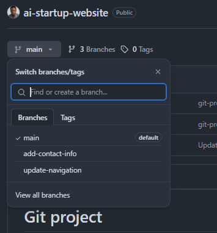
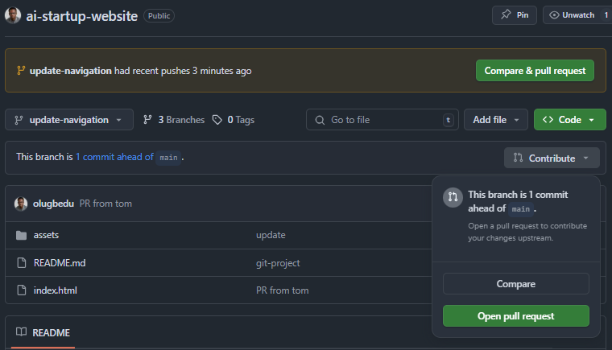
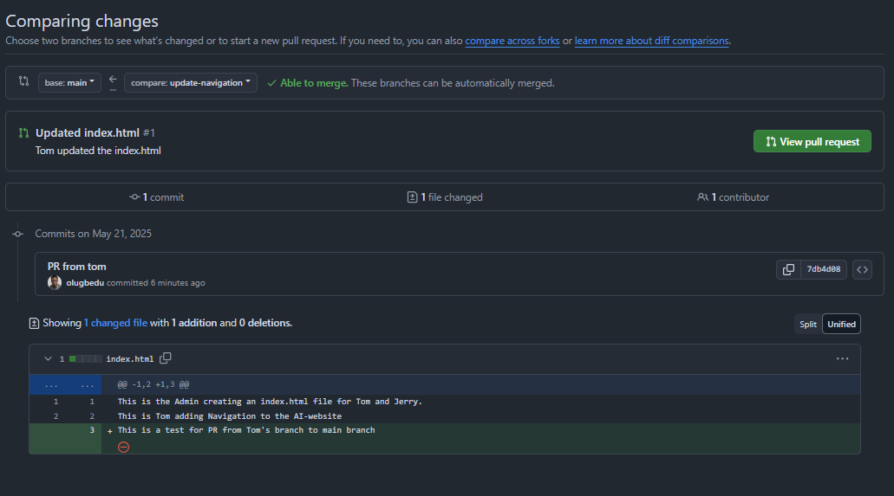
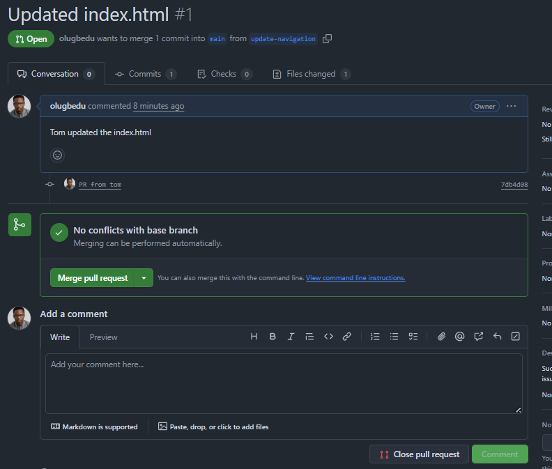
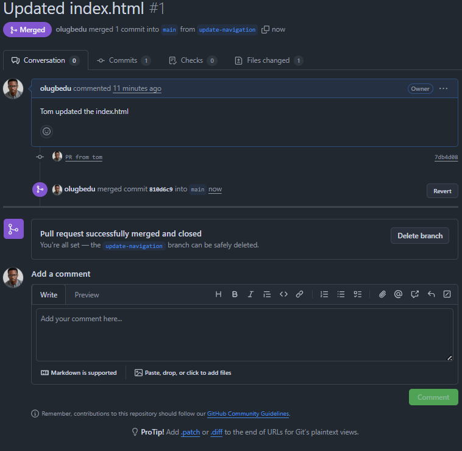
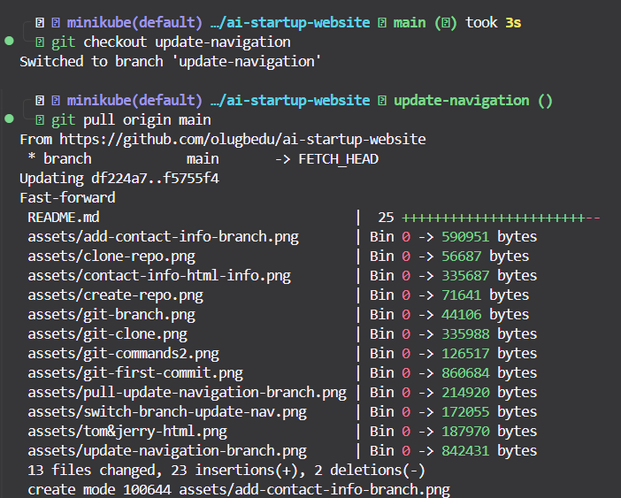
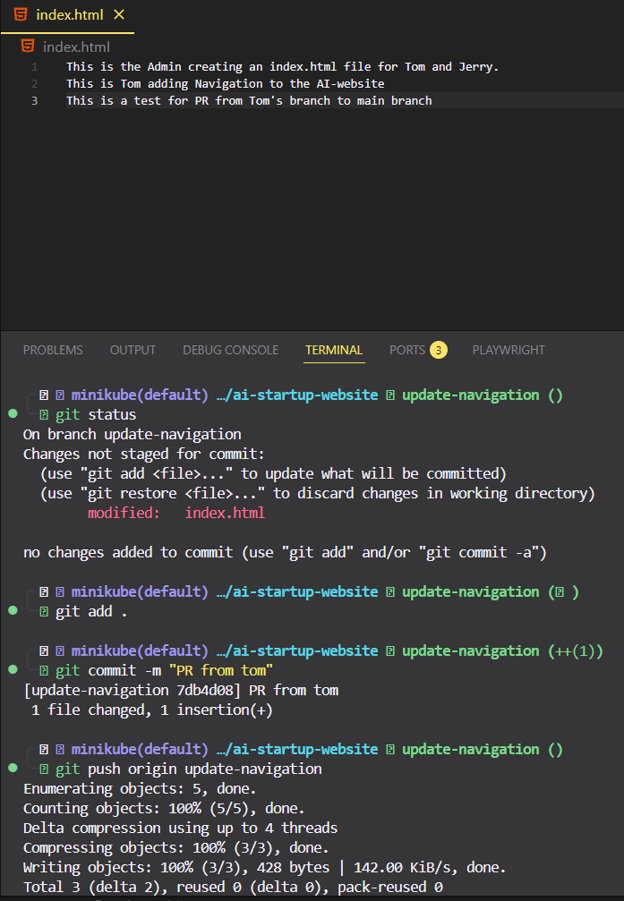

#  Git Branching and Merging

This document explains the collaborative Git workflow used for creating pull requests, reviewing code, and merging branches all essential for collaborative development.

---

## Step 1: Navigate to Your GitHub Repository

1. Open [https://github.com](https://github.com) and log into your account.
2. Go to the repository where you pushed your changes.


---

## Step 2: Switch to the Feature Branch

1. On the GitHub repo page, locate the **branch dropdown** near the top-left.
2. Select the branch you worked on (e.g., `update-navigation`, `add-contact-info`).



---

## Step 3: Create a New Pull Request

1. Click the **"Compare & pull request"** button that appears after pushing your branch.
2. Or go to the **"Pull requests"** tab and click **"New pull request"**.
3. Ensure:
   - **Base branch** is set to `main` (or your target branch)
   - **Compare branch** is set to your feature branch



---

## Step 4: Review Changes Before Merging

Before creating a pull request (PR), it's good practice to review changes for correctness and clarity. GitHub makes this easy by displaying the differences between the base branch (`main`) and the compare branch (e.g., `update-navigation`).

 **Review the diff to ensure everything looks correct before creating a PR.**



---

##  Step 5: Create the Pull Request

Once everything looks good:
1. Click **"Create pull request"**.
2. Add a **title** that clearly states the purpose of the PR.
3. Provide a **detailed description** including:
   - What was changed
   - Why the change was made
   - Any special context or testing steps




---

## Pull Changes from the Main Branch

Before merging another contributor’s work into your branch, fetch and integrate changes from the main branch using:




```bash
git pull origin main
